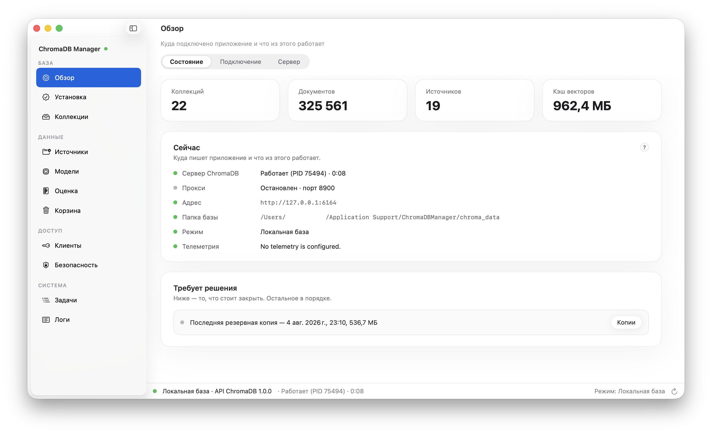
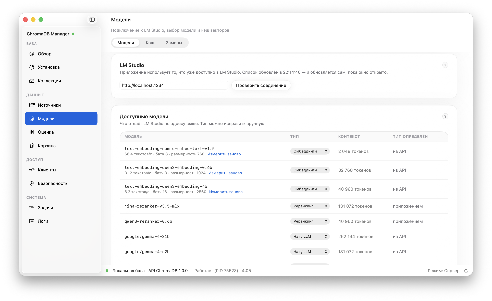
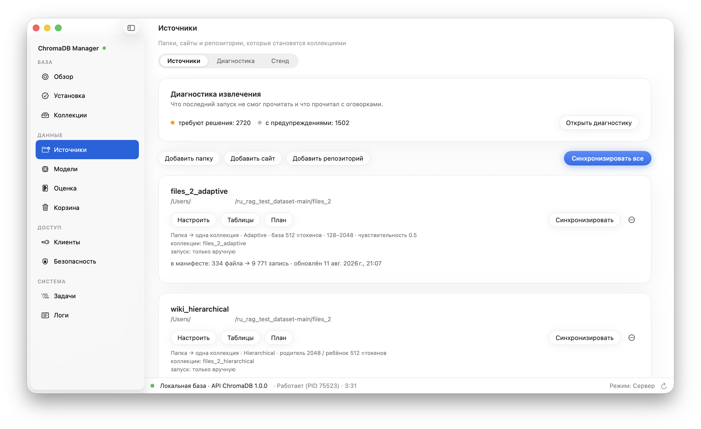
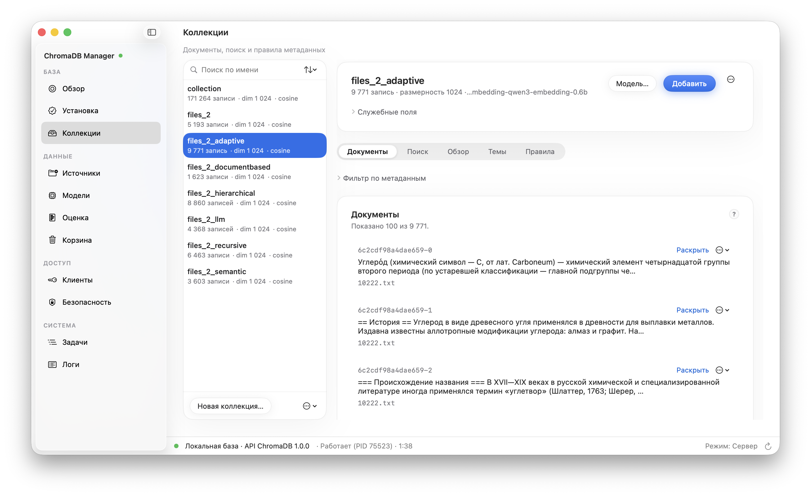
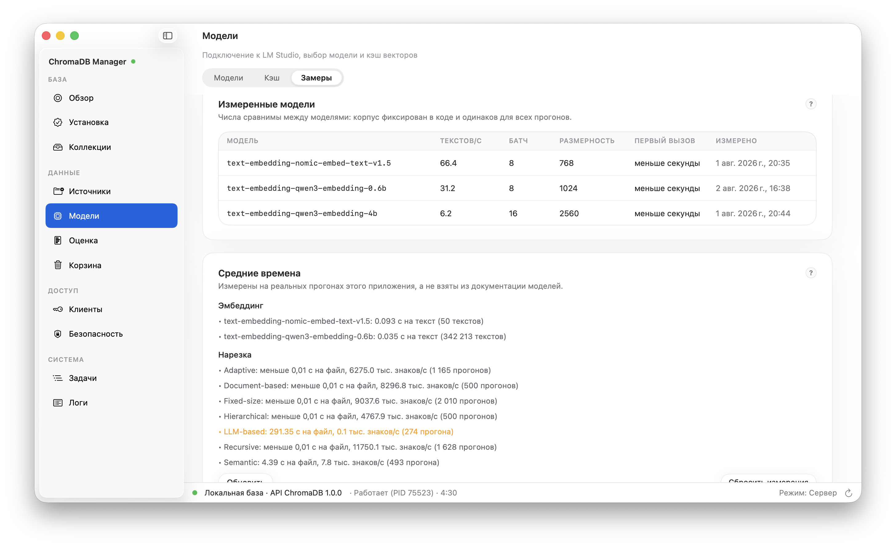
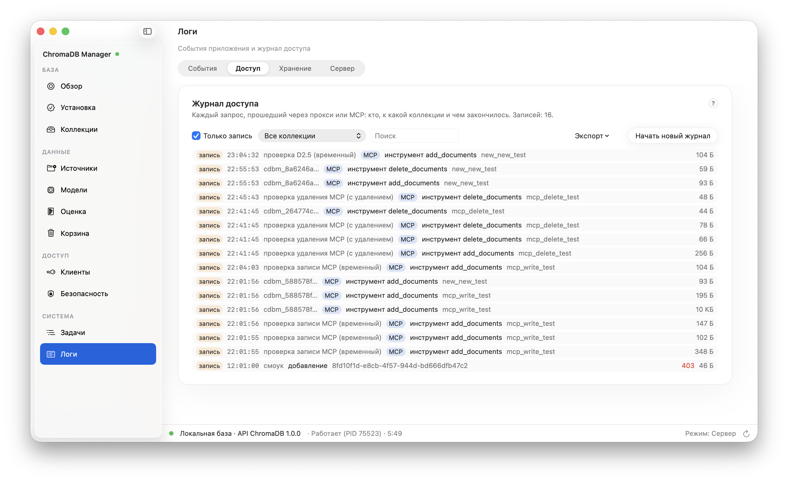
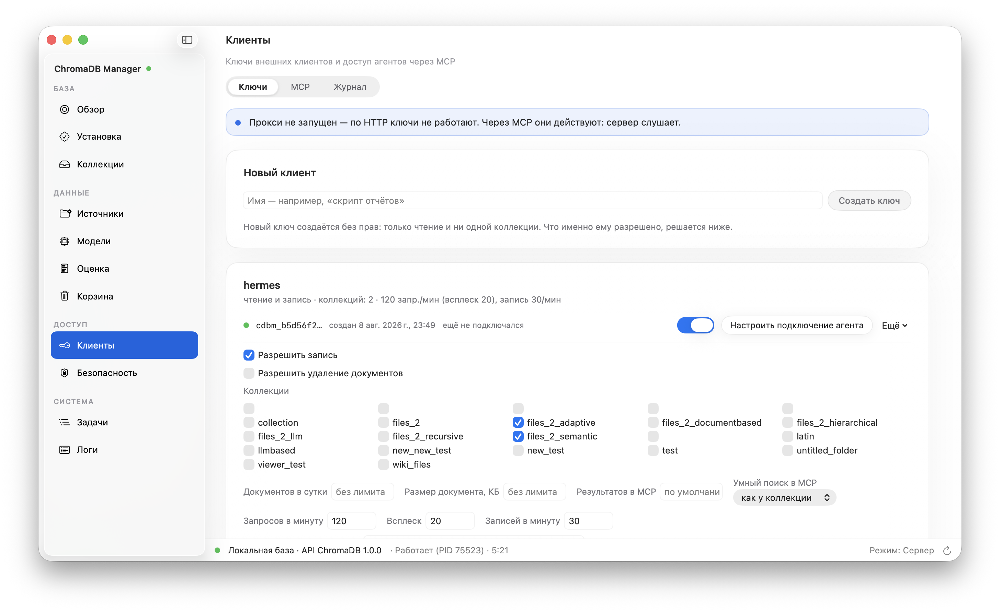

# ChromaDB Manager

<br clear="left">

A native macOS application (Swift + SwiftUI) for working with
[ChromaDB](https://www.trychroma.com/) without a terminal: installing and updating the engine,
connecting to a local database or a server, browsing and editing its contents, and computing
embeddings through a local [LM Studio](https://lmstudio.ai/).

> **Status: stages 1, 2 (2A–2E), 3 (3A–3D), 4 (text extraction) and 5 (table sources) are closed.**
> What follows describes only what is implemented and working; what is deliberately left
> undone is in [Known limitations](#known-limitations).



---

## Features

**Environment status and engine installation**
- Detects the installed Chroma CLI, its version and how it was installed; Python and pip are
  shown as information for path B, not as a requirement.
- **Path A (default): the standalone CLI, no Python at all.** The app shows the version, the
  file name, its size, the full URL of the official release and the equivalent command — and
  only downloads the binary into its own directory after you confirm.
- **Path B: `pip install chromadb` into the app's own virtual environment.** The system and
  Homebrew Pythons are left alone (PEP 668); `--break-system-packages` is never used.
- Update checks (GitHub Releases for path A, PyPI for path B) happen only on a button press or
  with an explicitly enabled setting; an ordinary launch never touches the network.
- Streaming command output with a cancel button and plain-language hints for the usual
  failures: no network, no permissions, PEP 668, an incompatible Python, a broken venv.

**Updating without losing data**
- The order: record collection counts → stop the server → copy the database directory →
  update → verify that the database opens and **the document counts match**.
- You can decline the copy only through a separate "I understand the risk" checkbox (off by
  default): storage-format migrations are irreversible.
- A list of backups with restore and delete; a manual copy is taken with the server stopped.

**Connecting**
- **Local database** — a folder on disk. A real `PersistentClient` only exists in Python, so
  the app raises a private server for that folder on `127.0.0.1` and an ephemeral port; you
  never see the ports.
- **Server** — a named profile: your own (the app starts and stops it, generating a YAML
  configuration with `allow_reset` and `persist_path`) or an external one (host, port, tenant,
  database, token). The "Check connection" button hits `/api/v2/healthcheck`.
- Tokens live in the Keychain; they are not in the configuration or the logs, and they are
  masked wherever they would otherwise be printed.
- The PID of a running server is remembered: after a crash the app finds the orphaned process
  and offers to stop it, or reuses it for the same folder.
- A missing local engine does not block the app — working with an external server is fully
  supported.

**The server**
- Start, stop and restart in one action; status with PID, uptime, address and database folder.
- A process-output panel: filter, switchable autoscroll, copy. Every launch is written to its
  own file in `~/Library/Logs/ChromaDBManager/servers/` (the last five are kept) — a server
  prints the most important thing right before it dies, and that has to survive the next start.
- **ChromaDB prints only a greeting and a crash report** — it has no per-request logging and no
  configurable log level (verified against a live server). The app says so in the panel;
  per-request visibility comes from the proxy's access log instead.
- Crashes are translated from Rust into human language: "Port 62367 is already taken by another
  process", with a hint on how to find the culprit, instead of a panic dump.
- The port is checked for occupancy **before** the start: `/healthcheck` does not answer the
  question of *whose* server replied, and without that check the app mistook a stranger's
  server for its own.
- A "Start the server when the app launches" switch; with it off, the app opens unconnected.

**The proxy and the access log**
- A local reverse proxy in front of ChromaDB: external clients go through it while the real
  server stays on a private port. ChromaDB itself has neither per-collection permissions nor a
  read-only mode — its authentication is a single token for the whole server, so any
  finer-grained access can only live here.
- Bytes are forwarded as they are, with no header rewriting, so the official `chromadb` Python
  client works through the proxy without a single change (verified).
- Request parsing was built from **captured traffic of the real client**, not from the API
  documentation: `get` and `query` are reads performed with POST, `count` is a GET with a query
  string, and deleting a collection goes by name where data operations go by UUID.
- The access log: who, when, which operation, which collection, status and volume. Filter by
  client, by collection, search, and CSV export. Written to
  `~/Library/Logs/ChromaDBManager/audit.jsonl`, one line per request, and it survives restarts.

**Clients, keys and permissions**
- A registry of external clients: name, key prefix, creation date, last activity.
- **The key is stored nowhere** — only its SHA-256 and its first characters. It is shown once,
  at creation; a forgotten key cannot be recovered even from the app's own files, only reissued.
- Per-client permissions: a whitelist of collections, permission to write, a daily document
  limit and a maximum document size. A new key is created **with no permissions at all**.
- The proxy checks every request: an unknown key gets 401, a write with a read-only key gets
  403, a collection outside the whitelist gets **404** (a refusal must not confirm that it
  exists), an unknown write operation gets 403, a vector of the wrong dimension gets 400, and
  exceeding a limit gets 429.
- The collection list is not refused but **trimmed**: a client only sees its own.
- The dimension check understands both vector formats — a JSON array and the base64 the
  official client sends. Checking the model itself is impossible, and that is written down in
  the limitations.
- A separate set of tests covers the "permission × operation" matrix, plus an end-to-end check
  with the real Python client: it works with a key and cannot connect without one.

**Security and network access**
- The "Security" screen: what is running right now, where it listens, how many keys are valid,
  how many refusals there were today, and a list of things worth a look — a proxy open to the
  network, a write permission with no daily limit, a key that is allowed no collection at all.
- **An emergency stop** in one button with confirmation: the proxy and the server stop, every
  key stops working immediately and permanently, and network access returns to "this computer
  only". Client permissions and limits are kept — only new keys need to be issued.
- **Only the proxy is ever exposed.** ChromaDB itself always stays on `127.0.0.1`: the server
  profile form has no "Host" field, starting on a network address is refused, and the proxy
  declines to open in front of a server that is not on loopback. Verified live: the database
  port does not answer from the machine's network address, the proxy port does — and returns
  401 without a key.
- The `127.0.0.1` / `0.0.0.0` switch asks for confirmation and shows the addresses clients will
  use. macOS may additionally ask about incoming connections.
- Notification Centre notifications for three events: the server died on its own, someone was
  refused access, an emergency stop was performed. Permission is requested once — when the
  switch is turned on. Refusals arrive in bursts, so they collapse into a single notification.

**Collections — the main screen**
- A list with record counts, dimension, bound model and an explicit "model unknown" mark for
  collections created by something other than this app.
- Browsing documents: ID, expandable text, metadata; the first 100 records and "Show more".
- Creating a collection with a chosen model. Without a model a collection can be created and
  read but not written to — the interface explains why instead of showing a dead button.
- **Binding a model to somebody else's collection.** The app says plainly that it cannot know
  which model produced the existing vectors and only checks the dimension; a mismatch is
  refused.
- **The distance metric is always sent explicitly, and defaults to `cosine`.** The server's own
  default is `l2`, while LM Studio models are normalised for cosine: a collection left on the
  server default works but ranks worse, and the only fix is to recreate it. The app always
  sends the metric, **reads it back** from the server and says so if it did not take effect.
  The metric is visible in the collection list and in the query result header; for cosine the
  distance is accompanied by a similarity percentage, for the others there is none, because
  their scale is unbounded. The metric of a foreign collection is taken from the server, and if
  the server says nothing, so does the app — "metric unknown", with no default substituted.
- Index parameters (`ef_construction`, `ef_search`, `max_neighbors`) live in a collapsed
  "advanced" block; an empty field means "let the server decide".
- **A large write is split automatically.** The per-request record limit is taken from the
  server itself (`/pre-flight-checks`) and shown on the connection card; if the server says
  nothing, a safe value of 1000 is used and that is stated outright. The second limit is the
  request body size, 32 MB: above 40 MiB the server answers `413`, and higher still it simply
  drops the connection. A failure in the middle is not hushed up: the message says how many
  parts were written and which one failed, and the import offers to **continue from the point
  of failure** rather than recomputing what is already stored.
- **Every call has its own timeout** — liveness 3 s, metadata 15 s, a page of documents 30 s,
  a query 60 s, a write 120 s, an embedding batch 300 s, a chat model 180 s; all configurable
  on the "Connection" screen. Automatic retries apply only to reads (two attempts, 0.5 s and
  1.5 s with jitter) and only for network failures and 502/503/504/429. **A write is never
  retried automatically**: an `upsert` that did not answer may still have been applied.
- **Quitting during a long operation asks for confirmation** and, if you agree, cancels it
  properly, finishing the journal, instead of killing the process.
- **A collection name is validated as you type** — with a specific reason ("two dots in a row",
  "must not look like an IP address") rather than a blanket "invalid name". The rules were
  taken from a live server, and a live test compares the validator against it line by line.
- **A collection can be deleted and recreated from another client** — the app survives that:
  a stale identifier is recognised from the response body, the name is re-resolved once, and
  the operation goes through. An empty 404 from an unknown endpoint does not count as that.
- **Database maintenance.** After bulk deletions the file does not shrink on its own, so there
  is a "Compact database" button: copy → stop the server → `chroma vacuum` → start → verify,
  with the size before and after. If the installed CLI has no such command, there is no button
  either.
- **A backup does not start when there is not enough room** — it needs the database size plus
  20 %, and both numbers are shown in advance. An interrupted copy is marked with a file and
  shown in the list as "damaged, restore unavailable" rather than as a restore point.
- **The access log never deletes itself**: when it overflows, the file is archived under its
  date, archives are removed only by hand with confirmation, and export is CSV and JSON.
  Ordinary logs rotate by size (10 MB, 5 files, configurable).
- **Tenants and databases.** The tenant's database list can be viewed right in the connection
  form; a non-existent database does not turn into an empty screen but offers to create itself.
  Deleting tenants and databases from the app is deliberately not implemented.
- **"Delete all application data"** — with the paths and sizes listed, a separate checkbox for
  backups, and an explicit list of what will never be deleted: your own database directories.
- **The filter builder is a tree, not a list.** Eight metadata operators, `$and`/`$or` with
  nesting, `$contains`/`$not_contains` over the document text, and both are sent together —
  including together with a semantic query. Values the server would reject (comparing a string,
  a list of mixed types) are named before sending, with the field name. Switching between tree
  and JSON loses nothing, and a filter the builder cannot display is executed as it is. Saved
  filters are kept per collection and survive a restart. The matrix of supported constructs was
  taken from a live server.
- **Adding a document with an ID that is already taken no longer loses the text.** `add`
  answers `201` and keeps the previous document without saying anything, so the app asks for
  you: overwrite or show the existing one. An import chooses its policy up front — skip
  duplicates (default), overwrite, or stop.
- **Model type and context length come from LM Studio's native API** (`/api/v0/models`): the
  OpenAI-compatible list reports neither, which forced the type to be guessed with a probe
  request — and the guess was wrong, because LM Studio answers an embedding call for chat
  models too.
- **Text longer than the model's context is never sent.** LM Studio answers `200` for input of
  any length and silently processes only the beginning: at 160 000 characters two texts
  differing only at the end produce **identical** vectors. So the length is checked before
  sending: over the context is refused with both numbers, 80–100 % is a warning, empty text is
  refused. One long line does not wreck an import: it is skipped and named, and in the chunking
  preview such chunks are highlighted before the sync starts.
- **Adding a single document**: text, an optional ID, key-value metadata. One document is one
  vector; there is no chunking at this level.
- Deleting a document; deleting a collection with confirmation by typing its name.
- Query: text → vector by the collection's model → nearest documents with their distance. If
  the collection's model is not available in LM Studio, the query is blocked rather than run
  with a different model.
- Resetting the database honours `allow_reset`: when the server forbids it, the app explains
  how to enable it instead of deleting the collections behind its back.

**Working with content**
- Pagination in pages of 100: a collection of any size is never loaded whole (verified on
  10 000 documents — a page is served in single-digit milliseconds).
- A metadata filter builder: fields, the operators `= ≠ > ≥ < ≤`, "in list", several conditions
  joined with `$and`. Values keep their type: `5` is filtered as a number, `true` as a boolean.
  The assembled where-query is visible next to it.
- A document-text filter (`where_document`) and a raw JSON field — for those who already know
  the query language.
- Expanding a document shows the full text and a vector preview: the dimension and the first
  components (the vector is requested only for the expanded document).
- Editing a document's metadata separately from its text; the `_cdbm_*` fields the app
  maintains are protected from hand editing.
- Editing a document's text **always** recomputes the vector with the collection's model:
  ChromaDB does not do it, and search would keep pointing at the old text.
- A document form: text typed in or loaded from a file, an optional ID, key-value metadata.
- CSV and JSON import: a CSV parser of our own (quotes, commas and line breaks inside fields,
  CRLF), a row preview, mapping columns onto text / ID / metadata, progress and cancellation.
  One row is one document; a repeated import with the same IDs updates records instead of
  breeding duplicates.

**Metadata schemas**
- A field builder: name, type (string / integer / float / boolean / ISO date), whether it is
  required, a default value. There are no lists or nested objects — ChromaDB stores scalars only.
- A date field can additionally write `<field>_ts` as a number: the server cannot compare ISO
  strings with `$gt`, while a range filter over a number works.
- The rules apply both to manual input and to imports — one model, two suppliers of values.
  A required field with no value, or a wrong type, blocks saving.
- A draft schema can be derived from the documents already loaded, and the schema itself can be
  exported to JSON and loaded on another machine (the collection name is substituted).
- "Check documents" walks the collection page by page and shows what does not match the rules.
  It is a report: the app rewrites nothing.

**Embeddings and LM Studio**
- Connecting to LM Studio, a model list with types: the type comes from the API, and where it
  is missing, from a probe call to `/v1/embeddings`; it can be overridden by hand.
- Choosing a default model for new collections. The app neither downloads nor installs models —
  that remains LM Studio's job.



**Data sources and synchronisation**
- Registering folders: an extension mask, recursive traversal, a per-source embedding model,
  key-value metadata of your own.
- Four mapping modes: folder → one collection; first-level subfolders → separate collections;
  one collection plus `relative_path` in the metadata; a manual rule (a regex over the path →
  a collection name). Files that matched no rule are not silently skipped — they are listed in
  the report.
- Seven chunking strategies: Fixed-size, Recursive, Document-based (Markdown headings, HTML
  tags, function and class boundaries), Hierarchical (parent and child chunks in one
  collection, linked by `parent_chunk_id`), Semantic (a cut where the meaning changes),
  Adaptive (size by text density) and LLM-based (a chat model decides the boundaries).
  Parameters unfold once a strategy is chosen; the expensive strategies show a cost warning
  **before** the run. Token counts are approximate and marked with `≈`.
- Text extraction: plain text, Markdown, CSV and code directly; other formats are in the
  "Document formats" block below.
- **Incremental synchronisation driven by a manifest.** A repeat run with nothing changed on
  disk creates no duplicates and recomputes no vectors; changing the chunking parameters or the
  model is a change too, and those files are re-chunked.
- **A re-index does not lose data if it is interrupted.** New chunks are written first, and
  only then is the tail removed — what the file used to occupy and no longer does, by an
  explicit list of identifiers. The intent is written to a journal with `fsync` **before** the
  first call to the database, so an interrupted run (the app was closed, LM Studio went away)
  is visible to the next launch and is replayed automatically: in two cases out of three
  without recomputing any vectors at all. Recovery is never silent: a line in the summary and
  in the logs. If replay fails, the source waits for a manual run and its automatic modes stay
  quiet.
- The "Plan" button shows what a synchronisation would do, writing nothing.
- **Automatic run modes** (set per source and combinable): at app launch, on a schedule (an
  interval or daily at a given time) and on folder changes through FSEvents with a settling
  pause. Any automatic run is visible: an indicator in the status bar, the start and the result
  in "Logs". There is a global "pause all automatic indexing" switch.
- **Files that disappeared from disk are never deleted automatically** — they go to the "needs
  a decision" list: remove from the database, keep, or decide later.
- Fitting the collection schema: you can see which required fields the source covers and which
  it does not; what happens with uncovered fields is a per-source setting (do not run, or index
  with an "needs attention" mark). If there is no schema, a draft can be generated from the
  source's own fields.
- Automatic fields on every chunk: `source_id`, `source_file`, `chunk_index`, `content_hash`,
  `file_ext`, `file_mtime`, `file_size` (plus `file_name`, `chunk_count` and `relative_path`
  in the path-aware modes).



**Document formats**
- **Not a single third-party dependency.** Everything is read with system frameworks: PDFKit,
  `NSAttributedString`, Vision, and ZIP through a `ZIPContainerReader` of our own on top of
  Compression. **Python is not needed for documents at all** — it remains only an optional way
  to install the ChromaDB engine itself (path B).
- `.pdf` — PDFKit: a page number on every chunk, the document outline becomes structure, and
  Document-based cuts a PDF along its own sections.
- `.docx`, `.doc`, `.rtf`, `.odt` — through the system reader. Headings are found heuristically
  by size and weight (style names never reach the app — verified), and that is marked honestly
  in the metadata. Tables are flattened to text: cells separated by tabs, rows by newlines,
  `has_tables: true` and a warning that the markup is lost. Comments and tracked changes are
  noticed from the container's contents.
- `.epub` of both versions — chapter order from the `spine`, the table of contents from
  `nav.xhtml` or `toc.ncx`, `spine_index` and `chapter_id` on the chunks. A DRM-protected file
  goes to "needs a decision" with the reason "protected by DRM", not to "damaged".
- `.pages` and `.key` — by asking Pages and Keynote themselves to export (the format is closed,
  and parsing it blindly means breaking on every iWork update). A presentation is cut by
  slides: one slide is one chunk, with `slide_number`, the slide title in `heading_path`, and
  the presenter notes as separate chunks of their own slides. Works both for a single file and
  for a package directory. Off by default: the path raises an application window and needs
  automation permission. A separate checkbox decides whether **automatic** runs may do it —
  otherwise Pages windows would open on a schedule.
- **OCR only when you say so.** A scan with recognition off goes to "needs a decision" with the
  reason "no text layer — looks like a scan" rather than being indexed as empty. With
  recognition on it goes through Vision, and the languages come from the system (the list
  depends on the macOS version, not on a table of ours). Recognised text is not cut by
  structure — there is none, and Recursive is more honest for it; the metadata carries
  `ocr_used`, the average confidence and a warning. Recognition is noticeably slower than
  ordinary reading, and that is said before the run, not after.
- **A password-protected PDF** asks for the password once, and the password lives only in the
  Keychain — not in `config.json`, not in the manifest, not in the logs, not in a settings
  transfer. A password that did not fit is called exactly that, so you are not asked to retype
  what you already typed.
- One unreadable file does not stop the others: it goes into the report with a reason and the
  run continues.
- A chunk's metadata shows how it was obtained: `extractor_id`, `extractor_version`,
  `container_format`, `structure_source`, `page_number`, `heading_path`, `spine_index`,
  `chapter_id`, `slide_number`, `has_tables`, `ocr_used`, `ocr_confidence_avg`. Fields an
  extractor did not check are not written at all: `has_tables: false` from someone who never
  looked is a claim, not an omission.
- **A new extractor version is an offer, not work.** Updating the app does not start hours of
  recomputation on its own: files extracted by the previous version are listed on the source's
  card with a button, and nothing happens until it is pressed.

**Web sources: a page, a list of addresses, a site crawl**
- Three kinds of source: **a single page**, **a list of addresses** and **a crawl** from a
  starting URL. The first two do not follow links at all.
- **A crawl has five limits, and all of them are mandatory**: depth (2 by default), page count
  (200), domain (the original only; `www.` is the same site), a pause between requests (1
  second, no parallel requests) and a total volume. Each is configurable, and each, when it
  fires, says so in the summary: a crawl that ended at a limit and a crawl that reached the end
  of the site are different news.
- **`robots.txt` is honoured**: forbidden addresses are not requested at all, and a site's
  `Crawl-delay` can only lengthen our pause. It can be turned off, but with a warning and a log
  entry on every run — on someone else's server the rules are theirs.
- **A sitemap is better than following links** and therefore replaces it: a page with no links
  from the home page cannot be found by following links. `sitemap.xml`, an index of nested
  sitemaps, `.xml.gz` and a plain list of addresses are all understood.
- **Page headings become `structure`**, so Document-based and Hierarchical chunking work for
  the web too: a page is cut along its sections.
- **Chunk metadata**: `source_url`, `page_title`, `fetched_at`, `http_status`, `content_type`
  and `canonical_url`. A page has no file name, so `file_name`, `file_mtime` and `file_size`
  are not written for the web.
- **A repeat sync is cheap**: `ETag` and `Last-Modified` go back to the server, and a 304 means
  there is nothing to recompute. For a server without conditional requests the hash of the
  extracted text is compared — the same `content_hash` the files use.
- **Non-HTML behind a link** (a PDF, a docx, a spreadsheet) goes to the stage-4 extractors — by
  the response type, not by the extension in the address: `report.html` regularly turns out to
  be a PDF.
- **A page that disappeared is not deleted**: 404 and 410 go to "needs a decision", just like a
  file gone from disk. A network error does not abort the crawl — the page is marked and the
  rest keep loading.

**Git repositories as a source**
- **The file list comes from `git ls-files`, not from walking the folder.** So neither `.git`
  nor `node_modules` nor build artefacts get indexed — not because someone guessed the right
  masks, but because the list is compiled by whoever manages them. The source's own masks and
  extensions narrow it further but never widen it. Submodules are not traversed.
- **What changed is answered by `git diff` from the stored commit** — one call instead of tens
  of thousands of reads and hashes. A file git did not name is never read. Text comparison
  remains the second level: a commit that only moved whitespace changes no vectors.
- **A rename costs no vectors at all.** A chunk's identifier is derived from the path, so
  chunks move to new identifiers carrying the same vectors — read, write the new, delete the
  old, update the manifest, in exactly that order.
- **Chunk metadata**: `git_relative_path`, `git_branch`, `git_commit`, and, as a separate
  setting, `last_commit_author` and `last_commit_date` (that is a `git log` per file, so it is
  off by default).
- **Uncommitted changes** are indexed or not, by a per-source setting.
- **A branch switch is noticed and starts nothing**: switching branches is an ordinary working
  action, while re-indexing a repository costs hours of a local model's time. The app shows how
  many files diverged and waits for a decision.
- **With git not installed the source still works**, simply as an ordinary folder, and says why.

**Collection health inspector and a view of what is inside**
- **The inspector only reads and reports.** No check ever fixes anything: every finding comes
  with an offer, and the decision is made by a human — separately and with confirmation. That
  is not a promise but a construction: the inspector works through a protocol that has no write
  methods.
- **Checks**: empty and too-short documents, documents without metadata, schema mismatches,
  orphaned chunks, gaps in chunk numbering (the trace of an interrupted sync), a collection
  with no model / metric / dimension, a vector dimension mismatch, duplicates by text.
- **"Documents outside sources" is a separate informational category**, not a defect: documents
  added by hand, by import or through MCP are synchronised by nobody, and complaining about
  them would teach you not to look at the inspector.
- **Similar documents are found with a vector taken from the database**: each sampled
  document's own vector → a query to the database → neighbours closer than a threshold. Not a
  single embedding call — otherwise the check would cost more than a re-index. A pair can be
  marked "these are not duplicates" and will not surface again.
- **Everything is computed on a sample**, and that is written in the report: "checked 1000 of
  48 000" is more honest than "no findings" with no caveat.
- **The report is exported** to Markdown and JSON, and the run history shows whether things got
  better or worse.
- **A collection overview**: distributions by source, extension, format, extractor and date (by
  month), plus a histogram of document lengths — a quick way to see that the chunking strategy
  is set up badly. Clicking a value takes you to the document list with the filter ready. This
  is **not** a visualisation of vectors: what is shown is the composition of the collection,
  not the vector space.



**Moving a collection: the `.chromaexport` package**
- **How this differs from a backup.** A backup ("Make a copy of the database") copies the
  **whole database directory** and only works for a local database with the server stopped. A
  `.chromaexport` package is **one collection**: it can be taken from an external server, moved
  to another machine, kept before an experiment, or exported as a subset by filter.
- **The format is a folder with two files.** `manifest.json`: format version, date, collection
  name, tenant and database, the source server's version, metric, dimension, model, document
  count and the SHA-256 of the data file. `documents.jsonl`: one line per document —
  `{ "id", "document", "metadata", "embedding" }`. Line by line, because a file of a million
  documents must not be assembled in memory either when writing or when reading: both sides
  stream.
- **Vectors are included by default**, but they can be left out: the package becomes several
  times smaller and is suitable for moving to another model — on import the vectors are
  recomputed.
- **Free space is checked before the start.** A failed or cancelled export deletes the package
  entirely: an unfinished file looks like a finished one and would eventually be imported.
- **Before an import**: the checksum is verified before the first write; a dimension mismatch
  is a refusal, a metric or model mismatch is a warning with confirmation; a package of a newer
  format version is not parsed by guesswork.
- **Identifier conflicts** — skip (default), overwrite or stop, with a report. A broken line is
  skipped and reported: one bad document does not bring down the transfer of a million. An
  interrupted import continues from where it stopped.

**Table sources**
- `.xlsx`, `.xlsm`, `.csv`, `.tsv`, `.ods` and `.numbers` (through Numbers itself). `.xls` and
  `.xlsb` are different binary formats, not variants of OOXML: such a file gets a reason and
  advice to re-save as `.xlsx` rather than being half-parsed.
- **A table is not indexed as text, and that is the whole point.** A flat line like
  `2024-03-15 | 4820 | Moscow` produces a vector that means nothing: searching by numbers and
  dates returns noise. So tables have their own pipeline, a relative of the CSV import rather
  than of the text-extraction subsystem.
- **Two modes per sheet, and they solve different problems.**
  - **"Data table"** — a row becomes **a separate document**: the chosen columns go into the
    text (the vector is computed from it), the rest into metadata. Such a collection is
    searched with a `where` filter over the columns plus meaning over the text: "`warehouse =
    Moscow` and `price < 100`, and something about galvanising in the description".
  - **"Document"** — the whole sheet becomes a Markdown table and is cut by the ordinary
    chunking strategy. For explanatory notes and reports with free-form layout. **The header
    row is repeated in every chunk** — without it the second chunk is a grid of values with no
    column names.
  - **"Do not index"** — service sheets. Hidden sheets land here by default.
- **Why this affects search quality.** In "data table" mode the vector is computed only from
  the meaningful columns: an article number and a price in the text are noise that makes
  products with the same numbers look similar. In "document" mode the vector is a piece of the
  whole table, and search answers "this report mentions it" rather than "here is the row". The
  mode is chosen per sheet; automatic detection only proposes and **always says why**.
- **The row text template** is editable (`{Name}. {Description}`) and visible in the preview
  before the run — what will be found depends directly on it.
- **A key column** (an article number, a code, an email) makes a row's identifier stable:
  editing a row updates the same document, and inserting rows above does not touch the others.
  Without one, insertion is still safe, but an edit creates a new document and the old one has
  to be deleted — the app warns about that.
- **Synchronisation is row by row.** Editing one cell in a 20 000-row sheet re-embeds **one**
  row; changing only metadata (price, warehouse) costs no vector at all. A row that disappeared
  is not deleted but goes to "needs a decision".
- **A mapping profile** is saved with the source and recognised by its set of headers. A file
  with a different set of columns is not half-indexed — it goes to "needs a decision" with the
  difference spelled out: which profile came closest, which columns are missing, which are
  extra.
- **A profile describes the whole workbook.** Inside it are variants, one per sheet: "Goods and
  services" is read by its own mapping, "Financials" next to it by another, and it is one
  profile because it is one file.
- **A file can be assigned a profile by hand** — from a drop-down by name in the source's table
  list. By default the profile is still matched by columns; assignment is for the cases
  matching cannot answer: identical headers on exports that mean different things, a report
  header above the table. Assignment does not disable the column check.
- **Profiles are exported and imported as a file.** Marking up someone else's format is done by
  hand once, and that knowledge should travel. Profiles with the same name are replaced on
  import, the rest are added — and you are told which is which.
- **The cost is shown before the run.** A 50 000-row sheet means 50 000 calls to a local model.
  Before the start you see the number of rows and a time estimate from the **measured** speed
  of the model, and you are offered a trial run on the first N rows.
- Automatic fields on every row: `source_file`, `sheet_name`, `row_number`, `row_key`,
  `table_mode`. A column whose name collides with a service field gets a `col_` prefix — and
  that is said, not done silently.

**Extraction diagnostics**
- A screen listing the files that could not be read and the files read with caveats. The state
  comes from the last run's manifest — opening the screen re-reads nothing.
- Every problem has a reason and a suggested action derived from the error itself: turn on
  recognition, enter a password, retry, exclude. Retry and exclude are always available.
- **Excluding is not deleting.** The file stops being read, and any chunks already written go
  to "needs a decision" — the decision is yours. The exclusion is visible on the source's card
  with a "bring it back" link.

**The test bench**
- Computing an embedding for entered text: dimension, time, the first components of the vector.
- Comparing several models on the same text — time and dimension side by side.
- Cosine similarity of two texts under a chosen model.
- **A preview of extraction and chunking**: file → which extractor fired and its version, the
  format, the source of the structure, the outline that was recognised, the warnings — **before**
  anything is written to the database. Then the chunks with their sizes, each with the anchor
  that will go into its metadata: page, slide, `heading_path`.
- The preview reads the file **with the chosen source's settings**: otherwise a scan that your
  source reads perfectly well with recognition on would look unreadable here. And it cuts the
  text with the same code the synchronisation uses — a preview that disagrees with the real run
  is worse than no preview.

**Recomputing vectors**
- Two explicit operations instead of a "change the model" switch: cloning into a new collection
  (the default — the original is untouched) and recomputing in place with confirmation by
  typing the collection name.
- **A backup is mandatory and cannot be skipped**: for a local database the app stops the
  server, copies the folder and starts the server again; for an external server it exports the
  documents and metadata to JSON.
- A collection's dimension is immutable in ChromaDB, so a model of a different dimension is
  available only through cloning — the app checks that when the model is chosen and explains,
  instead of failing halfway.
- Progress with the number processed and remaining, pause and cancel. Cancelling leaves a
  consistent state: an unfinished clone is deleted, an unfinished in-place recompute continues
  from the last checkpoint.
- When it finishes there is a self-check: the document count is compared and a test query is run.
- An operation log in "Logs": what, when, with which model and with what outcome.

**Statistics**
- A table of "collection → source → model → strategy → dimension → documents → last sync" and a
  summary by model.
- Average embedding and chunking times, **measured on real runs**; LLM-based is shown on its
  own line, because it is noticeably more expensive than the rest.



**The search pipeline**

Search is not a single `query` call but eight stages in a fixed order. The order is fixed for a
reason: diversity before and after promoting to the parent give different answers.

| # | Stage | What it does |
|---|---|---|
| 1 | Candidate generation | vector search and/or text search over the document contents |
| 2 | Fusion | merges the two lists with Reciprocal Rank Fusion |
| 3 | Collapsing | several hits from one section become one result |
| 4 | Diversity | MMR — picking results that are unlike each other |
| 5 | Promote to parent | the whole section is returned instead of a child chunk |
| 6 | Context expansion | attaches neighbouring chunks of the same file |
| 7 | Re-ranking | a chat model reorders the final list |
| 8 | Truncation | cut down to `n_results` |

Only the first and the last are mandatory. A pipeline with everything off is exactly ordinary
vector search, down to the size of the requested pool.

- **None of these settings requires re-embedding.** They are query parameters, not a property
  of the data, and that is what makes them fundamentally different from the model, the metric
  and the chunking strategy: those are fixed at the moment the vectors are computed and change
  only by recomputing the whole collection. A search profile can be changed as often as you
  like and variants compared on the very same vectors — which is what makes tuning cheap.
- **Search profiles** are named sets of settings bound to a collection. They are stored locally
  (`~/Library/Application Support/ChromaDBManager/search-profiles.json`), not in the
  collection's metadata. They are created, switched, duplicated, exported and imported right
  from the query panel; an import adds profiles rather than overwriting them.
- **The "Smart search" switch** returns ordinary vector search in one click without erasing
  anything: the profile's settings stay where they are. It is per collection.
- **The "How this result came about" panel** (collapsed by default) shows, for the last query:
  the vector time separately from the stages, how many candidates entered and left each stage,
  what was dropped and why, and how long each took. A "Copy" button puts all of it into the
  clipboard as text. With the panel open, every result is annotated with its source and its
  position in it.
- **Query history** is local, searchable, with pinning for frequent ones and an "add to set"
  button: that is how a query set for the evaluation bench gets filled. Repeating a query
  updates its entry rather than adding a new one; the history never reaches the database.
- The hierarchical stages (3 and 5) turn themselves off on a collection cut at a single level
  and cost nothing there — including the candidate pool size.

**The quality evaluation bench**

The working cycle is "create a variant → run → label → compare":

1. **A query set.** Queries accumulate from the search history with the "add to set" button —
   that is the main way; nobody writes twenty queries by hand. A query can also be typed into
   the set's card: text, filter, tags, a comment; renaming and deleting the set, deleting a
   query and moving a set to another machine through JSON live there too. The ground truth is
   given as **a fragment of the found text**, not as a chunk identifier: identifiers are
   incomparable between variants that were cut differently — that is, in exactly the comparison
   the bench exists for.
2. **Variants.** A variant is "a collection plus a search profile". Two variants differing only
   in the profile compare two settings of the same data and cost not a single recomputed
   vector. The profile is stored inside the variant in full: a month-old run describes the
   parameters it ran with, not the ones that have been edited since.
3. **A run.** Before the start you see an estimate of the number of calls and the time. The
   vector is computed once per "query + model" pair — the second variant on the same model
   reuses it. Cancelling keeps what was collected and marks the run incomplete.
4. **Labelling.** Three buttons on every result, right in the report. The label goes into the
   set, and the metrics are recomputed without another run.
5. **Judging by a chat model** *(optional, off by default)*. The model walks the results and
   says whether each answers the query, with an explanation. That is a hint for the person
   labelling, not a label: its verdict reaches neither the ground truth nor the metrics — it
   can only be accepted one by one, by hand. Before the start you see the number of calls, and
   the time only if that model's speed has already been measured.
6. **The report.** A "variant × metric" table — hit rate@k, recall@k, MRR, nDCG@k, and
   latencies split between the vector and the search. The set of k values is configured with
   buttons above the table and changes the columns without another run. The best value in a
   column is highlighted, but only when there is more than one variant and the values differ.
   Below it are the queries where the variants diverged most: an average across the board does
   not show where a variant actually failed. Next to it is a "before and after" comparison with
   any past run (variants are matched by name). If the variants return texts of very different
   lengths, the report says so outright: the ground truth is a fragment of text, and a variant
   answering with a whole section contains it more often simply because it answers in bigger
   pieces — its hit rate can only be compared with a caveat. Export to Markdown and JSON: the
   variants' full parameters, the metrics, the outcome for every query.

There is no single "quality score" and there will not be one: the metrics answer different
questions, and collapsing them into one number hides exactly what the bench is for.

**Logs**
- A panel with filters by source and level, search and copy; in parallel everything is written
  to `~/Library/Logs/ChromaDBManager/`, and a button opens the file in Finder.



---

## Requirements

| What | Version |
|---|---|
| macOS | 14 Sonoma or newer |
| Xcode | 15 or newer (tested on 26.6), Command Line Tools |
| Swift | 5.9+ |
| ChromaDB | 1.x — the app installs it for you |
| Python 3 | for path B only; not needed for the standalone CLI, not needed to read documents |
| LM Studio | needed for embeddings and queries; installed separately by you |
| Pages, Keynote | only for `.pages` and `.key`; the other formats are read without them |
| Numbers | only for `.numbers`; `.xlsx`, `.ods` and `.csv` are read without it |

Nothing special is required on a Mac before the first launch: the app checks for the engine and
offers to install it. LM Studio is only needed once you get to embeddings — the app neither
downloads nor installs models.

---

## Building and running

```bash
git clone <repository-url> && cd ChromaDBManager
```

**In Xcode.** `open Package.swift` → the `ChromaDBManager` scheme → the "My Mac" target →
⌘B, ⌘R. There are no external dependencies; Swift Package Manager fetches nothing.

**From the terminal.**

```bash
xcodebuild -scheme ChromaDBManager-Package -destination 'platform=macOS' build
xcodebuild -scheme ChromaDBManager-Package -destination 'platform=macOS' test
./Scripts/build-app.sh release && open "dist/ChromaDB Manager.app"
```

The script assembles `dist/ChromaDB Manager.app` with the Info.plist, the icon, the
entitlements and a signature (Hardened Runtime, ad-hoc identity).

### Tests

```bash
swift test              # the whole suite on recorded answers, without ChromaDB or LM Studio
CHROMA_IT=1 swift test  # the same suite plus the live tests — against a real server and LM Studio
```

The unit tests run on recorded JSON fixtures and need neither ChromaDB nor LM Studio nor a
network. The integration tests are enabled with `CHROMA_IT=1` and raise a real `chroma run`
(`xcodebuild` does not pass the variable into the test process — use `swift test`). A few checks
need variables of their own and are skipped by default.

### Demo data

```bash
chroma run --path ./demo-db --host 127.0.0.1 --port 8000 &
Scripts/seed-demo-data.sh --port 8000 --dim 768
```

The script fills a database with a small demonstration collection over HTTP, **without** the
`_cdbm_*` metadata — which is how the "I came to look at somebody else's database and bind a
model by hand" scenario gets tested.

---

## Signing and the sandbox

App Sandbox is **off**: the app launches external executables (`chroma`, `python3`, `pip`),
which is incompatible with the sandbox. Hardened Runtime is on, and the entitlements are
`com.apple.security.network.client` and `com.apple.security.network.server` (the second one for
the proxy layer: it listens on a port, and when it is opened to the network macOS will
additionally ask about incoming connections). Distribution is by Developer ID, outside the Mac
App Store; local builds use an ad-hoc signature.

A consequence: security-scoped bookmarks are unnecessary, and folder paths are stored as plain
strings.

---

## Architecture

In short: MVVM, three layers, and a single path to the data — HTTP API v2; a "local database"
is a private `chroma run` managed by the app; embeddings are computed by the app rather than by
the server, which is why every collection has a model and a dimension bound to it.

More in [docs/ARCHITECTURE.md](docs/ARCHITECTURE.md).
How to report a vulnerability — [SECURITY.md](SECURITY.md).

---

## Menu bar, drag and drop, Services and Shortcuts

**The menu bar icon** shows whether indexing is running and how many tasks are waiting, offers
a global pause and a quick search over a chosen collection. Clicking a result opens the source
document. The icon can be hidden; "stay in the menu bar after the window is closed" is off by
default and available only together with the icon — an app with neither a window nor an icon
could be neither opened nor closed.

**A global hotkey** (⌃⌥⌘K by default, disabled) opens the quick-search panel above any
application. It does **not** require Accessibility permission: the combination is registered
with the system rather than read from other apps' key presses.

**Drag and drop.** A folder or files can be dropped on the app window or on the Dock icon. The
app asks what to do: register the folder as a source (with change tracking) or add the files as
documents to a chosen collection. A one-off addition does not cut the text into pieces — a file
that does not fit the model's context will be named, not silently truncated; for such files,
create a source.

**The Services menu.** Two items: "Add text to ChromaDB Manager" for text selected in any
application, and "Add files to ChromaDB Manager" for files selected in Finder. The names differ
for a reason: with identical names the system cannot choose between them and the service simply
does not fire. **The system registers Services only for an app in a standard location** — copy
`ChromaDB Manager.app` to `/Applications` (or `~/Applications`) and run
`/System/Library/CoreServices/pbs -flush`. The items will not appear for a build inside the
repository's `dist/`, and the copy in `/Applications` has to be refreshed after every rebuild.

**Shortcuts.** Three actions: "Search a collection", "Add text to a collection", "Synchronise a
source". The intent metadata is assembled by `Scripts/build-app.sh`, and that step **needs Xcode
installed** — without it the app still builds and runs, but there will be no actions in
Shortcuts; the script says so on a line of its own. All three actions require the app to be
running and connected to a database.

## MCP: letting agents work with the database

Agent applications (Claude Desktop, Claude Code and other MCP clients) connect to the database
through **tools**, not through API calls. The app raises an MCP server itself while it is
running; the agent talks to it through a `chromadb-mcp` helper inside the bundle.

**How this differs from the stage-3 proxy, and why it is better for agents.** The proxy exposes
ChromaDB's own REST API — the same one any library client uses. An agent does not read that
documentation: it reads tool descriptions. But that is not the main difference.

> Through the proxy a client sends **a vector**, and the app can only check its dimension —
> matching dimensions say nothing about which model produced it. Through MCP an agent sends
> **text**, and the vector is computed by the app with the model bound to the collection.
> Writing a vector from a foreign model into a collection is physically impossible, because
> vectors are never transmitted at all.

Everything else follows: an agent's search goes through the same pipeline as the search on
screen, with all the settings you have tuned; the results carry the distance together with the
metric; long documents are truncated **with a mark**, not silently.

**The tools.** `list_collections` and `describe_collection` (metadata fields with types and
example values — without them a model builds filters by guesswork), `search` (by text, with a
metadata filter in ChromaDB syntax and by substring), `get_documents` (by identifier or by
page), `add_documents` and `delete_documents`. Creating and deleting collections through MCP is
not possible at all.

**Permissions are the same keys the proxy uses**, on the "Clients" screen: a whitelist of
collections, read, write, a separate permission to delete, rate and volume limits, a ceiling on
the number of results, and a decision on whether smart search works for that key. A collection
outside the access list is invisible and answers "not found" — the existence of somebody else's
collection is not disclosed. A separate "read-only for all keys" switch revokes writing for
everyone at once.

**What you see.** The "MCP server" card on the "Clients" screen shows the state, who is
connected right now and the recent calls; every call lands in the access log shared with the
proxy, with the full text of the parameters. Documents added by an agent are marked with
`origin: "mcp"`; deleted ones go to the trash if it is enabled.

**Connecting.** "More" → "Set up an agent connection" on a client's card gives you a ready
configuration fragment with the path to the bridge and the key, and a check button: the app
performs a test call through the same transport and shows how far it got. The key is filled in
only if it is on screen at that moment — the app stores only its hash.



> **What has not been verified.** Connecting from **a real agent application** is the one
> readiness item of stage 7 still open: it requires editing your Claude Desktop or Claude Code
> configuration, and the app cannot do that for you. Everything else is verified, including
> test calls through the real bridge from the bundle.

## Known limitations

- **Web pages are read without a "reader mode".** Scripts, styles, menus, headers and footers
  are thrown away, but there is no proper extraction of the main text — a page with complex
  layout will bring a little navigation into the text. Pages drawn by a script in the browser
  are not supported at all: such a page is recognised by empty text with a successful response
  and goes to "needs a decision" with that reason instead of being indexed empty.
- **The project builds as a Swift Package, not as an `.xcodeproj`.** Xcode opens `Package.swift`
  directly, `xcodebuild build/test` works, and the `.app` is assembled by
  `Scripts/build-app.sh` with an ad-hoc signature. A generated project will come with the first
  distribution outside the development machine — and so will Developer ID, notarisation and an
  asset catalog.
- A local database requires the Chroma CLI to be installed. Working with an external server
  does not.
- **Vectors of already-computed texts are kept in a cache** (`embedding-cache.sqlite3`, up to
  2 GB by default, evicted by least recent use). It saves the most expensive thing — the local
  model's time — and affects nothing but speed: the cache can be turned off or cleared on the
  "Embeddings" screen.
- **Deleting the application's data also deletes the installed engine.** Both installations —
  the standalone CLI in `bin/chroma` and `venv/` — live inside the app's directory, so "delete
  all data" also means "install ChromaDB again". The dialog says so outright, and only when the
  engine really is there: one installed by Homebrew or pipx is left alone.
- **The app never re-indexes a collection whose chunking recipe changed.** It reports that the
  collection has become inhomogeneous and repeats that on every synchronisation until you
  re-index or clone it. There are no automatic re-indexes or deletions in the app at all.
- **A document's origin is recorded in the `origin` field** (`manual`, `import`, `source`,
  `external`) — statistics and the health inspector use it. It is never backfilled into foreign
  collections: documents created by something else stay without it until the app rewrites them
  itself.
- A collection's model is only checked by vector dimension: finding out which model produced
  somebody else's embeddings is impossible in principle. The same limitation applies in the
  proxy: "an external client must use the same model" is enforced as a dimension match — an
  available approximation, not a guarantee.
- **ChromaDB does not guarantee document order while paging.** `limit`/`offset` come with no
  server-side sorting: if the collection changes while you page through it, pages may repeat or
  be skipped. The app does not fix that but reports it — it compares document counts and warns;
  for precise work with specific documents there is the filter.
- **The comparisons `>`, `<`, `≥`, `≤` in a filter only work with numbers.** The server rejects
  strings and dates; to compare dates, enable timestamp writing in the metadata schema — a
  numeric `<key>_ts` field then appears next to the date.
- The proxy does not support `Transfer-Encoding: chunked` — a request with such a body is
  refused. Neither ChromaDB nor its official client uses it (verified), and parsing a body
  halfway during a permission check is worse than an honest refusal.
- **A collection's dimension is fixed forever by its first write** — even after the collection
  is cleared. So an in-place recompute is only possible onto a model of the same dimension; for
  any other, cloning remains.
- Re-chunking during a recompute works from the text in the database. For collections filled by
  a source it is better to change the source's parameters and synchronise again — then the
  files are read from disk.
- **Automatic indexing timers live only while the app is running.** The app installs no
  `launchd` agents and no background daemons. Second-level precision is not guaranteed: macOS
  holds back timers for an inactive app (App Nap), so a run may be delayed by tens of seconds.
- Document-based relies on heuristics rather than on parsing a language: Markdown headings,
  outer occurrences of the named HTML tags, and declarations at the start of a line for code.
  Whatever the heuristic did not parse lands in one big section, which the chosen fallback
  splits.
- LLM-based depends on how obedient the chat model is. An answer that does not match the format
  either raises an error or falls back to Recursive — by the source's setting; fallback chunks
  are marked in the metadata.
- **The app chooses the LLM chunking window size itself** — by two limits at once: what fits
  the context the model was loaded with, and what it manages to rewrite within the source's
  timeout. Writing speed is measured on the model itself rather than assumed. So the window is
  smaller on a slow model and larger on a fast one, and raising the context does not by itself
  raise the window. The answer length is limited too: a model that has gone into a loop is cut
  off by the limit rather than by the timeout.
- Token counting is approximate (`≈`): an exact tokeniser for the model is not available
  through the LM Studio API.
- **The structure of office documents is a heuristic, not markup.** Paragraph style names
  (`Heading 1`) never reach the app: the system reader hands over only the font and the
  paragraph. Headings are determined by size, weight and line length, and such chunks carry
  `structure_source: heuristic` with a warning — trust it exactly that far.
- **Table markup is lost.** Cells are joined with tabs and rows with newlines; merged cells,
  nested tables and column headers as such are not reconstructed. Table formats (`.xlsx` and
  the like) do **not** go through the text-extraction subsystem at all: a table row is a record
  with fields, not a paragraph, and its place is in the metadata rather than in the vector.
- **`.pages` and `.key` require Pages and Keynote to be installed** and automation permission
  to be granted: the format is closed, and only the application itself can read it. Without
  permission or without the program the file goes to "needs a decision" with the exact reason.
  The export raises the application's window, so it is off by default for automatic runs.
- **OCR recognises text but not structure.** Headings, columns and tables are not recovered
  from a scan, and recognised text is always cut with Recursive. Speed is seconds per page, and
  on a large folder that is hours.
- Extraction reads documents but not their history: comments, footnotes and tracked changes do
  not reach the text. Their presence is noticed and named in a warning, so that it does not
  look like a loss.
- **Late chunking will not be implemented**: the method needs token-level embeddings, while the
  OpenAI-compatible `/v1/embeddings` in LM Studio returns one averaged vector per text.
- **The whole security model rests on the proxy.** ChromaDB itself has no per-collection ACLs
  and no read-only mode — its built-in authentication is a single shared token for the whole
  server. That is why only the proxy is ever exposed, and why the app starts the server on
  `127.0.0.1` exclusively. Anyone who bypasses the proxy and reaches the database port directly
  from the same machine reaches the database with no permissions at all; the protection is
  designed against the network, not against other users of this Mac.
- **Proxy traffic is not encrypted.** The proxy listens over plain HTTP, so a client key
  travels in clear text and is visible to whoever listens on the segment. Opening the proxy to
  the network only makes sense on a network you trust. TLS with a self-signed certificate will
  arrive together with a signed build for distribution — the certificate's private key lives in
  the Keychain, and access to it is unstable with an ad-hoc signature, so doing TLS before a
  stable signature means doing it twice. Listening on `127.0.0.1` without encryption is fine:
  the traffic never leaves the machine.
- Notifications only work in an assembled app (`Scripts/build-app.sh`): outside a bundle
  Notification Center is unavailable, and the app says so honestly instead of showing a switch.
- Exposure through ngrok or an equivalent is not implemented — opening to the local network
  covers the same scenario without a third-party service.
- The first time a port is opened to the network, the macOS firewall may ask for permission for
  incoming connections; without it nobody connects from outside, and the app warns about that.
- A 2D visualisation of embeddings is deliberately out of scope.

---

## License

[Mozilla Public License 2.0](LICENSE).

File-level copyleft: modified files of this project stay open under the same license, while
your own code added alongside can be licensed however you like, including proprietary. The
patent license from contributors is granted explicitly (section 2.1); trademarks are not (section 2.3).

There is no per-file header: under Exhibit A the notice may be kept where a recipient would
look for it, which here is the `LICENSE` file at the root of the repository. It covers
everything in the repository.
